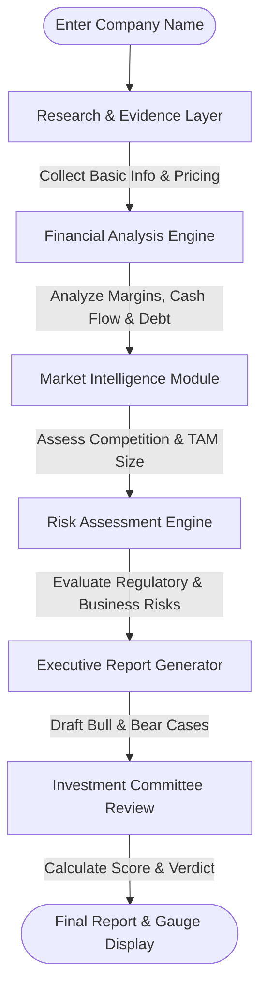

# InvestIQ Terminal

InvestIQ Terminal is a professional, institutional-grade equity research platform designed for investment analysts, hedge funds, venture capital firms, and portfolio management teams.

The platform accepts a corporate entity name and runs a structured quantitative research workflow to evaluate financial performance, valuation metrics, competitive moats, regulatory exposures, and outputs a consensus committee verdict.

---

## 🌟 Key Features

1. **Structured Research Workflow:** Orchestrates a sequence of 6 specialized analytical stages (Research Baseline, Financial Audit, Market Share mapping, Risk Modeling, Report Generation, and Committee Consensus Review).
2. **Research Workflow Console:** Displays step-by-step terminal stage logs as each analysis module evaluates the target company, showing users exactly how the platform reaches its conclusions.
3. **Interactive Financial Dashboards:** Premium dark-theme layout with responsive Recharts graphs (Area/Bar Revenue growths and Risk category Radar charts).
4. **Client-Side PDF Exporter:** Compiles compiled reports into structured, multi-page PDFs with clean section breaks and callouts.
5. **Watchlist & Search History:** Allows users to save favorite tickers, manage watchlist items, and review past searches (persisted locally in browser cache).
6. **Side-by-Side Comparison:** Compares metrics, ratings, P/E valuations, growth margins, and thesis statements for up to 3 companies side-by-side.

---

## 🏗 Architecture & Research Workflow

The terminal executes a linear pipeline where each analysis module receives the cumulative state, performs its specific task, appends processing logs, and returns updated data channels:



### The 6 Core Analytical Stages:
1. **Research & Evidence Layer:** Verifies the corporate name, identifies ticker codes, fetches sectors, and gathers fundamental corporate summaries.
2. **Financial Analysis Engine:** Extracts revenue growth curves, operating profit margins, debt-to-equity leverage indices, and free cash flows.
3. **Market Intelligence Module:** Identifies main industry competitors, determines market share, and outlines addressable space (TAM).
4. **Risk Assessment Engine:** Measures financial, regulatory, competitive, and valuation exposures to compute a consolidated Risk Score.
5. **Executive Report Generator:** Weighs positives (Bull cases) and key concerns (Bear cases) to prepare structured reports.
6. **Investment Committee Review:** Aggregates all indicators to output a final rating (`Invest`, `Watchlist`, or `Pass`), an overall investment score, and the Investment Confidence Index.

---

## 🚦 Setup Instructions

### 1. Requirements
- Node.js 18.0 or later
- npm or pnpm

### 2. Installation
Clone or navigate to the project directory and install dependencies:
```bash
npm install
```

### 3. Running Locally
Run the development server:
```bash
npm run dev
```
Open [http://localhost:3000](http://localhost:3000) in your browser to view the terminal.
